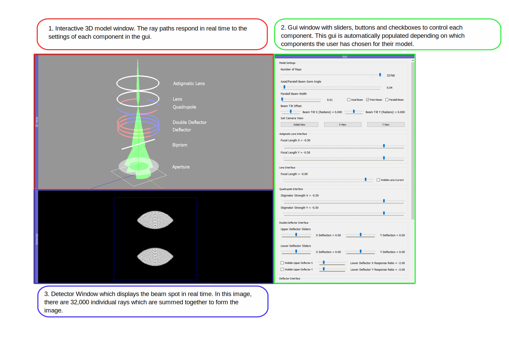

.. TemGym documentation master file, created by
   sphinx-quickstart on Thu Sep 22 15:08:17 2022.
   You can adapt this file completely to your liking, but it should at least
   contain the root `toctree` directive.

========
TomoBank
========

The X-ray Tomography Data Bank or TomoBank, provides a repository of experimental 
and simulated data sets with the aim to foster collaboration among computational scientists, 
beamline scientists and experimentalists, to accelerate the development of tomographic 
reconstruction and 3D visualization methods and to speed up their implementation in the various 
synchrotron facility data analysis software packages.

If you use the tomoBank Toolbox for your research, we would appreciate it if you would refer to the following papers :cite:`decarlo:01`:

	De Carlo, Francesco, et al. "TomoBank: a tomographic data repository for computational x-ray science." Measurement Science and Technology 29.3 (2018): 034004. http://www.doi.org/10.1088/1361-6501/aa9c19

From 2016 to 2021, TomoBank relied on `Petrel <http://petrel.alcf.anl.gov/>`_ :cite:`petrel:19`, a resource of the 
`Argonne Leadership Computing Facility <https://www.alcf.anl.gov>`_, which is a U.S. Department of Energy (DOE) Office of Science User Facility located at Argonne National Laboratory and supported under Contract DE-AC02-06CH11357.

From 2022 TomoBank relies on `Eagle <https://www.alcf.anl.gov/alcf-resources/storage-and-networking>`_, a resource of the 
`Argonne Leadership Computing Facility <https://www.alcf.anl.gov>`_, which is a U.S. Department of Energy (DOE) Office of Science User Facility located at Argonne National Laboratory and supported under Contract DE-AC02-06CH11357.

Features
--------

* Tomographic datasets and phantom repository available via `Globus <https://app.globus.org/file-manager?origin_id=9f00a780-4aee-42a7-b7f4-6a2773c8da30&origin_path=%2F>`_

* Python scripts to read and reconstruct all data sets

Example: ::

    $ tomopy recon --file-name tomo_0001.h5 --rotation-axis 1024.0

Contribute
----------

* Documentation: https://github.com/tomography/tomobank/tree/master/
* Issue Tracker: https://github.com/tomography/tomobank/issues

Content
-------

.. toctree::
   :maxdepth: 1

   source/about
   source/usage
   source/data
   source/phantom
   source/volumes
   source/publish
   source/credits
   source/license

