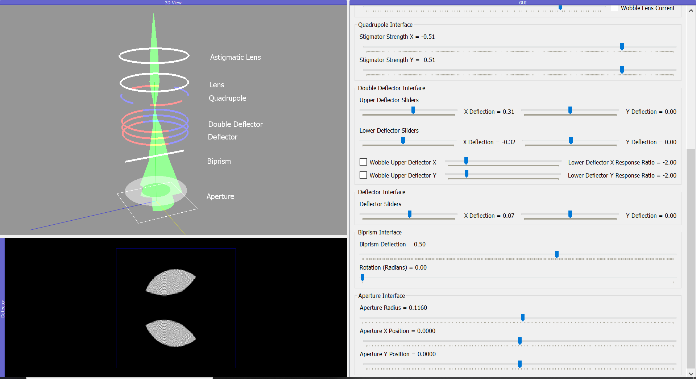

.. TemGym documentation master file, created by
   sphinx-quickstart on Thu Sep 22 15:08:17 2022.
   You can adapt this file completely to your liking, but it should at least
   contain the root `toctree` directive.

=============
TemGym Basic
=============

TemGym Basic is a ray-tracing software that models and visualises the first order behaviour of 
components inside a transmission electron microscope.

.. image:: /img/GUI_graphic.svg
   :width: 900px

The interactive models we generate are designed with a focus
on educating new users on how the basic alignments work inside a TEM. 
Our code is also capable of producing publication
quality ray diagrams with a single function call. 

Features
--------

* Interactive TEM models generated with pyqtgraph & PyQt5.

* Ready-made example direct alignment models that enable users to learn at their own pace in an offline manner.

* Generate interactive models of a transmission & scanning electron microscope.

* Easy to use python code which allows users to create their own models by naming components inside a python list.

* Generate publication quality ray diagrams of electron microscope experimental setups with one function call. 

Component Overview
------------------
Our python code consists of 8 different electron microscope components which can be combined
to create a model microscope. 

* Lens
* Astigmatic Lens
* Deflector
* Double Deflector
* Aperture
* Stigmator
* Biprism
* Sample

We can easily create an example model containing all of these components by first importing the required packages
into a python script.

.. literalinclude:: /../pyqtgraph_examples/all_components_example_pyqt.py
   :language: python
   :lines: 1-6

Then we add the components into a list, and specify their position inside the microscope on the z-axis.

.. literalinclude:: /../pyqtgraph_examples/all_components_example_pyqt.py
   :language: python
   :lines: 8-19

Then input the model into our pyqt function that creates the interactive 3D viewer and automatically populates
the GUI.

.. literalinclude:: /../pyqtgraph_examples/all_components_example_pyqt.py
   :language: python
   :lines: 21-22

which generates an interactive window on your PC. 

.. image:: /img/all_components_example.png
.. image:: //img/all_components_example.png

Contents
--------

.. toctree::
   :maxdepth: 2
   :caption: Tutorials

   source/usage

.. toctree::
   :maxdepth: 2
   :caption: Examples
   
   source/tutorials
   source/showcases
   source/matplotlib

.. toctree::
   :maxdepth: 2
   :caption: Reference

   source/documentation
   source/license

   